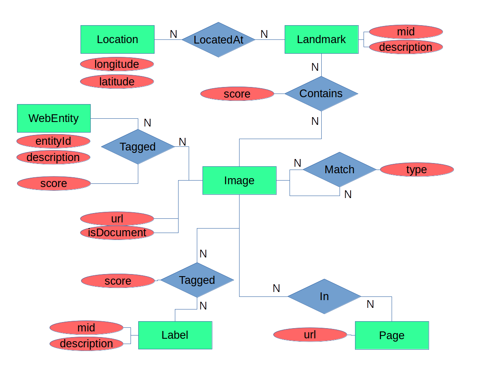

# Homework 2: Neo4j database of image analysis from Google Cloud Vision API
### Due: October 15, 2018
### Prof Michael Mandel `mim@sci.brooklyn.cuny.edu`

For this assignment, you will be interacting with a set of JSON documents in 
Neo4j. The JSON documents are the output of the Google Cloud Vision API applied 
to images returned from a Flickr API query for interesting images related
to the text "New York".

I have provided starter code in python, but you may will write code in a language
of your choice (Python, Java, Bash, etc) to load the JSON into the database
and query it. You will submit your code, the output of your queries, and a brief
report describing your approach.

## Install and setup Neo4j

1. Download Neo4j community edition for your platform from
   http://neo4j.com/download/ and unzip it.
1. Follow the guide on using the Neo4j browser:
   http://neo4j.com/developer/guide-neo4j-browser/ . When
   prompted, *set the password for user `neo4j` to `cisc7610`*
   so that eventually I can use your 
   code on my own neo4j database with the same settings.  It will
   guide you through the process of starting the server running locally
   on your computer and connecting to it through your laptop.
    * Note that if you initially use a different password, you can change your password using the cypher query `:server change-password`
1. Learn about Neo4j.  Run the following cypher queries in the Neo4j web interface, which generate sets of "slides" to get you familiar with Neo4j.
   1. `:play intro`
   1. `:play concepts`
   1. `:play movie graph`
1. You might also want to read this article to get started
   http://neo4j.com/developer/graph-db-vs-rdbms/
1. After running the movie graph example, open the sidebar by
   clicking on the three circles in the top left of the screen.  Select
   the entire database by clicking on the `*` button under "Node
   labels".  Take a screenshot of the graph to be included in your
   report.

## Install python-neo4j driver

Use `pip` to instlal the neo4j-driver package:

```bash
pip install neo4j-driver
```

The following code should run from the commandline and print "Worked!" without generating any errors.  If it doesn't, then you have a problem with your python configuration or the installation of the neo4j-driver package.

```bash
python -c 'import neo4j; print("Worked!")'
```

   
## Introduction to the data (same as homework 1)

The data is the same as for homework 1.
The file `example.json` contains
a JSON document that has all of the fields that may be present in the
individual JSON documents. Note that this is not a valid JSON document
itself because in lists it only contains a single entry followed by "...". 
Although individual JSON documents may not contain all of these fields, if
they do, they will be in the structure shown in `example.json`. The
entity-relationship diagram for the schema to be used in importing the 
data into SQLite is shown in the following figure:



The annotations come from the Google Cloud Vision API and are described in
here https://cloud.google.com/vision/docs/reference/rest/v1/images/annotate#AnnotateImageResponse .
I have only included the following subset of those annotations, however:

 * `landmarkAnnotations` -- identify geographical landmarks in photographs. 
   For the purposes of discussing entities in the database
   schema, this will add `Landmarks`, each of which can have zero or more
   `Locationss`.
 * `labelAnnotations` -- predict descriptive labels for images. This will
   add `Label` entities to the schema.
 * `webDetection` -- predict the presence of web entities (things with
   names) in images along with pages that contain the image and other
   images that are similar. This will add `WebEntity`, `Page`, and `Image`
   entities to the schema.
   
## Introduction to code   

All of the python code is contained in the file [`runNeo4j.py`](https://github.com/cisc7610/homework2/blob/master/runNeo4j.py).
If you have all of the necessary dependencies installed, you should be able to run the script as it is to 
complete very basic versions of each of the tasks in the homework: 
 * Populate the database
 * Query the database

If it is working, it should print out (among other things):
```
Query 7.0

    SELECT COUNT(*) FROM image;
    
    100
```


## Write code to import the data

Implement the Cypher query stored as the string [`insertQuery`](https://github.com/cisc7610/homework2/blob/master/runNeo4j.py#L40) in the `populateNeo4j()` function. `insertQuery` is run on each JSON document from the analysis of a single image by Google Cloud Vision API.

Importing JSON documents into Neo4j is rather complicated, but because of this, querying it is straightforward.  The basic idea is that different sub-structures of a JSON document should be represented by different node types in the database and these will all be created at the same time using a single, combined query.

First, read this tutorial on importing JSON into Neo4j:
 * https://neo4j.com/blog/cypher-load-json-from-url/

In order to import the JSON documents into Neo4j, we will write a query in Neo4j's Cypher language composed of several `MERGE` clauses and several `FOREACH` loops.  The `MERGE` clause finds an existing node or relationship matching a given specification, or creates it if it doesn't already exist.  The syntax of the `MERGE` clause is
```cypher
MERGE (varName:LabelName {mustHaveProperty: value1})
  ON CREATE SET varName.optionalProperty = value2
  ON MATCH SET varName.optionalProperty = value3
```

In this case, the `MERGE` uses the name `varName` to refer to a node with a label of `LabelName` and with a property called `mustHaveProperty` that has a value of `value1`.  If no such node exists, it is created, and the `ON CREATE SET` clause is executed, setting the additional property of `optionalProperty` to `value2`.  If that node already exists, the `ON MATCH SET` clause is executed, setting `optionalProperty` to `value3`.  The `ON CREATE SET` and `ON MATCH SET` clauses are both optional.  Multiple property-value pairs can be specified by separating them with commas.

The `MERGE` clause can also be used to find or create relationships
```cypher
MERGE (n1 {property1: value1})
MERGE (n2 {property2: value2})
MERGE (n1)-[relVal:REL_LABEL {property3: value3}]->(n2)
  ON CREATE SET relVar.optionalProperty = value4
  ON MATCH SET relVar.optionalProperty = value5
```
This will create or find two nodes having the specified property-value pairs.  The nodes are called `n1` and `n2` for the purposes of this clause.  The `MERGE` then finds or creates a relationship between those two nodes with a property `property3` having value `value3`, which it refers to as `relVar`.  Again, if it is found the `ON MATCH SET` clause is executed and if it is created, the `ON CREATE SET` clause is executed.  Notice that several `MERGE` clauses can follow one another to build up more complicated structures and relationships.

The `FOREACH` clause loops over the elements of an array, setting a variable to be each one in turn.  In the case of a JSON array, it will loop over objects in the array allowing you to write a `MERGE` clause for each one.  The syntax of the `FOREACH` statement is
```cypher
FOREACH (jsonArrayElement in json.fields.array |
  MERGE (nodeName:LabelName {property: jsonArrayElement.value}))
```

Note the use of the extra parentheses around the whole statement except for the `FOREACH` keyword and the pipe character `|` separating the loop setup from the loop body.  The JSON structure is navigated using field names separated by periods without any quotation marks or other punctuation, so the statement `json.fields.array` will index into the `array` object within the `fields` object within the `json` object.  This statement will loop over the array `json.fields.array` setting a variable called `jsonArrayElement` to each value in turn and will then find or create a node called `nodeName` with label `LabelName` and property `property` equal to the property `value` from `jsonArrayElement`.

The following resources could be helpful in importing the JSON data into neo4j
 * http://neo4j.com/docs/developer-manual/current/cypher/clauses/merge/
 * http://neo4j.com/docs/developer-manual/current/cypher/clauses/foreach/
 * https://neo4j.com/developer/language-guides/

After importing the JSON into Neo4j, the total number of each label should be:

| Entity | Count |
| ------ | -----:|
| image | 560 |
| label | 201 |
| page | 556 |
| landmark | 18 |
| location | 26 |
| webEntity | 451 |


## Write code to query the database

Implement the missing TODO entries in the [`queryNeo4j()` function](https://github.com/cisc7610/homework2/blob/master/runNeo4j.py#L77).
You should use the supplied [`queryNeo4jAndPrintResults()`](https://github.com/cisc7610/homework2/blob/master/runNeo4j.py#L151) function
to query the database.  The queries should be as follows:

1. Count the total number of JSON documents in the database
2. Count the total number of Images, Labels, Landmarks,
   Locations, Pages, and WebEntity's in the database.
3. List all of the Images that are associated with the
   Label with an id of "/m/015kr" (which has the description
   "bridge") ordered by the score of the association between them
   from highest to lowest
4. List the 10 most frequent WebEntitys that are applied
   to the same Images as the Label with an id of "/m/015kr" (which
   has the description "bridge"). List them in descending order of
   the number of times they appear, followed by their entityId
   alphabetically
5. Find Images associated with Landmarks that are not "New York"
   (id "/m/059rby") or "New York City" (id "/m/02nd ") ordered
   alphabetically by landmark description and then by image URL.
6. List the 10 Labels that have been applied to the most Images along with
   the number of Images each has been applied to
7. List the 10 Pages that are linked to the most Images through
   the webEntities.pagesWithMatchingImages JSON property along with
   the number of Images linked to each one. Sort them by count
   (descending) and then by page URL.
8. List the 10 pairs of Images that appear on the most Pages
   together through the webEntities.pagesWithMatchingImages JSON
   property. Order them by the number of pages that they appear on
   together (descending), then by the URL of the first. Make sure
   that each pair is only listed once regardless of which is first
   and which is second.


## Update this file (REAME.md) with a description of your approach and code (here)

 1. Describe the language that you implemented your code in
 2. Include instructions for how to run your code to populate the database
    and to query the database
 3. Paste the results from each of the queries
 4. Describe any problems that you ran into in the course of this project
